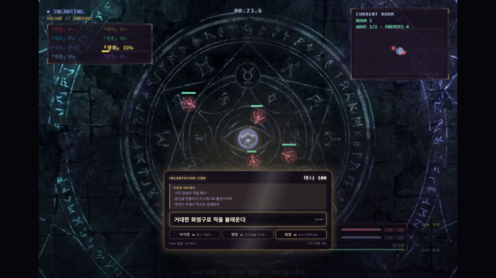
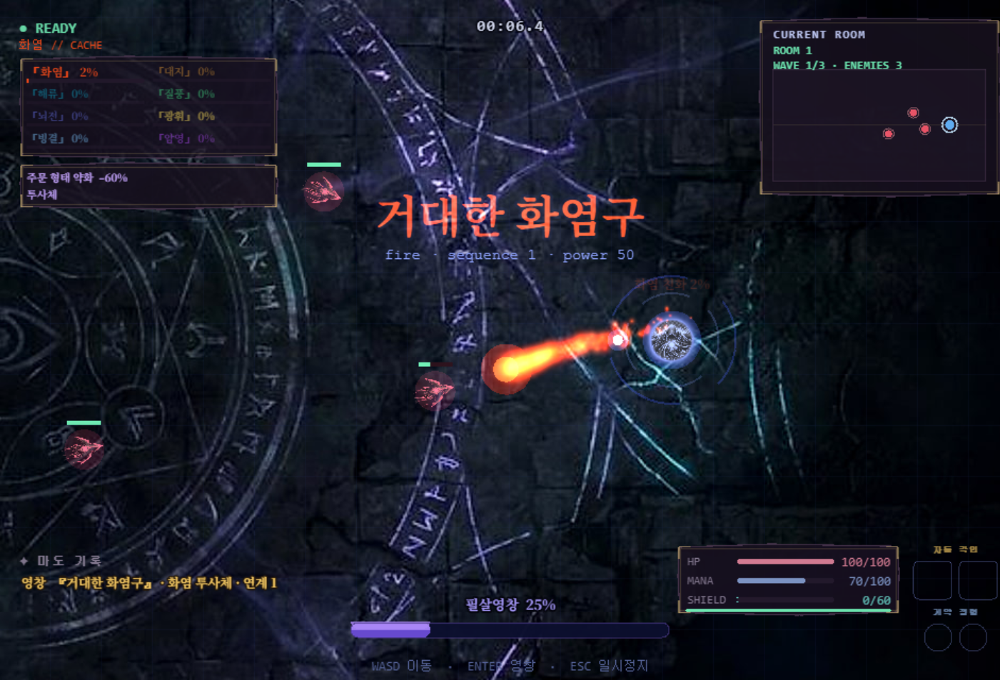
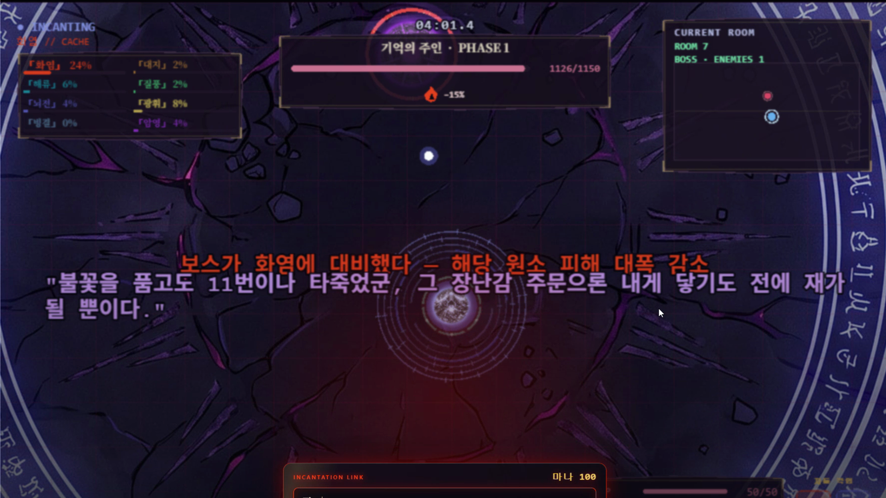
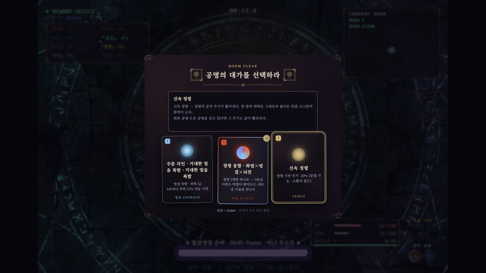

# INCANT — 게임 소개·설명 문서

<!-- pdf:skip -->
> ⚠️ **아래 블록은 팀 작업용 — PDF에 실리지 않는다** (`scripts/build-submission-pdf.mjs`가
> `pdf:skip` 구간을 걷어낸다). 버전 이력과 확정 전 체크를 여기 두고, 제출본은 본문만 싣는다.
>
> **상태: v7 (2026-08-08 갱신, 총괄).** 영상 링크만 남기고 본문·스크린샷 확정.
>
> **갱신분(v7):**
> - **스크린샷 6장 삽입** (R2 촬영, #391). 프로덕션 빌드 1920×1080 실플레이 · 합성 없음
> - **⚠️ v5의 과교정 되돌림 — 소환 행동 DSL 예시 복원.** v5는 #319가 `move`를 제거했다며
>   "분신을 지그재그로 돌진" 예시를 뺐는데, **#319가 뺀 것은 플레이어 이동**(`player move
>   실행, 시전 중 이동 잠금`)이고 **소환수 행동 DSL은 그대로 살아 있다** — 워커 프롬프트에
>   `orbit·chase·dash·zigzag·hold·retreat` 6부품과 `"지그재그로 접근하다 돌진" → [zigzag, dash]`
>   예시가 현역이고 `behaviorRunner.ts`가 이를 실행한다. 게임이 할 수 있는 것을 문서만
>   못 한다고 적고 있었다
>
> **갱신분(v6) — 전수 사실 감사:** 코드로 대조해 확인한 것 —
> 형태 13·원소 8·효과 6·상태이상 6 ✅ / 조작표(WASD·Enter·Shift+Enter·A,D·W,S·ESC) ✅ /
> 마나 대역 10·25·40(`incantBands`의 power 17·42·67 × 0.6) ✅ / 각인·정령 슬롯 각 2칸 ✅ /
> 연구 3축과 1회차 2택→2회차 3택 ✅.
> **정정 1건 — 총 방 수.** "8개의 방"이라고 적혀 있었으나 실런은 절차 생성 맵을 쓴다
> (`runMapDefinition`이 `generateRunMap(seed)`, 프리셋은 실패 폴백). 500시드 실측 **9~11방**
> (10방 60%)이라 고정 수치를 쓸 수 없다.
>
> **갱신분(v5) — 코드 대조로 확인한 사실 정정:**
> - **행동 설계(`move`) 서술을 시간축 설계(`form`/`wait`)로 교체.** #319에서 판정 계약의
>   `move`를 제거해 "지그재그로 돌진" 예시가 **더 이상 재현되지 않는다.** 개요·표현의 폭
>   두 곳에 있던 예시를 실제 동작하는 것으로 바꿨다
> - 형태 12종 → **13종** (`slash` 추가)
> - 조작표에 보상 `A/D`·경로 `W/S` 추가(#306, 화살표 제거됨) · 기본 공격이 자동임을 명시
> - 2-4 성장 절을 **연구 주제 3축** 기준으로 재작성 (종전 "두 갈래 빌드"는 연구 시스템
>   도입 전 서술) · 친화가 위력을 바꾸지 않는다는 서술 삭제(실제로 바꾼다)
>
> 변환 전 체크: □ 최신 프로덕션 빌드 확인 ☑ 스크린샷 6장 삽입 □ 데모 URL 접속 확인
> □ 시퀀스·필살영창 재현 확인 ☑ 판정 p50·폴백률 기입(8/6 실측) □ **영상 링크 기입(§4)**
> ☑ 분량 — **본문 5쪽 + 스크린샷 4쪽 = 9쪽**. 종전 자체 기준 "≤6쪽"을 넘겼으나,
> 대회 요건에 쪽수 제한은 없고(제출 계획서 §1 확인) 스크린샷은 심사위원이 문서에서
> 가장 먼저 보는 것이라 축소하지 않았다. 6장을 1920×1080 원본 그대로 싣는다.
<!-- /pdf:skip -->

## 1. 개요

**INCANT**는 정해진 스킬이 없는 로그라이크다. 플레이어가 **자유 문장으로 주문을 영창**하면
LLM(Gemini)이 의미·창의성을 실시간 판정해 원소·형태·위력을 가진 마법으로 구현한다.

> "얼음 감옥에 가둬라" → 빙결 속박 / "분신을 만들어서 지그재그로 돌진시켜라" → 분신이 그 움직임을 그대로 실행한다

핵심 긴장: **보스가 당신의 주문을 기억한다.** 애용한 원소에는 저항이 생기고, 회차가 쌓일수록
세계가 당신의 수를 읽는다(런 격상). 살아남으려면 매 순간 **새로운 말**을 창작해야 한다 —
게임의 자원은 HP가 아니라 **어휘력**이다.

| 항목 | 내용 |
|---|---|
| 장르 | AI-네이티브 로그라이크 (탑다운 아레나) |
| 플랫폼 | 웹 (데스크톱 브라우저) |
| 데모 | https://jaepaly.github.io/NHN-Project/ |
| 기술 | Phaser 3.90 · TypeScript · Vite · Gemini(Cloudflare 프록시) |
| 팀 | 3인 — R1 게임코어·에셋 / R2 AI 시스템 / R3 콘텐츠·UX·총괄 |

## 2. 핵심 시스템

### 2-1. 말이 곧 마법 — 판정 파이프라인
```
자유 문장 → LLM 판정(원소 8 × 형태 13 × 효과 6 × 상태이상 6 × 위력 0~100) → 실시간 이펙트
```
- 같은 문장 반복은 힘을 잃고(**반복 억제**), 원소·형태를 바꾸면 **COMBO 보너스**(다양성 당근).
- 판정 실패·타임아웃 시 로컬 Mock 판정으로 **자동 폴백 — 게임은 절대 멈추지 않는다**.
  (실측 2026-08-06, 신규 문장 20종 · 캐시 없는 경로 · 클라이언트와 같은 기준
  〈시도 타임아웃 2.5초 · 최대 2시도〉: **판정 p50 1.34초 · p90 1.63초 · 폴백 0/20회**)
- 일반 영창은 단일 주문 또는 검증된 `form/wait` 시퀀스로 실행되며, 실행·위력·마나·시간 제한은 로컬 검증기가 소유한다.
- 시퀀스 판정은 `VITE_SEQUENCE_JUDGE=0`으로 단일 주문 경로에 되돌릴 수 있어 제출 환경에서도 안전하게 복구된다.

### 2-2. 표현의 폭 — "생각한 마법이 대부분 된다"
| 말하면 | 된다 |
|---|---|
| "질풍으로 빨라져라" / "철벽 무적" / "돌진" | 자기 강화(가속·무적·순간이동) |
| "불태워 서서히 녹여라" / "얼려버려" | 상태이상(지속화상·빙결경직·감전연쇄·저주약화) |
| "내 분신을 만들어" / "화염 포탑" / "벌레 군체" | 소환 변형(분신·포탑·3기 군체) |
| **"불덩이를 세 번 연달아, 마지막은 크게"** | **LLM이 시간축을 설계** — `form → wait → form`으로 박자를 짠다 |
| **"분신을 만들어서 지그재그로 돌진시켜라"** | **LLM이 소환수의 움직임을 설계** — `[zigzag, dash]` 프로그램을 조립한다 |
| "돌벽을 세워라" / "번개 장판" / "삼각형 얼음 방벽" | 지형·장판·형상(`ring`·`polygon`) |

> **설계하는 AI(위 4·5행)가 이 게임의 핵심 주장이다.** LLM이 메뉴에서 하나를 고르는 게
> 아니라, 문장을 읽고 **부품을 조립해** 돌려준다. 설계 대상은 둘이다:
>
> - **시간축** — 여러 단계를 순서와 간격까지 정한다. 명시적인 연사는 `wait` 간격으로,
>   동시에 일어나는 사건은 병렬 form으로 갈린다.
> - **소환수의 움직임** — `orbit`·`chase`·`dash`·`zigzag`·`hold`·`retreat` 여섯 부품을
>   순서대로 엮는다. *"지그재그로 접근하다 돌진"* → `[zigzag, dash]`.
>
> 안전은 로컬이 쥔다 — 실행 가능한 form이 없는 계획은 거부하고, 위력·마나·시간 제한은
> 로컬 검증기가 소유하며, 계약 위반 출력은 재판정한다. *창의는 LLM이, 규칙은 게임이.*
>
> (실측: 시간축 신규 묘사 30종 30/30 계약 준수 · 평균 1,443ms · p90 1,576ms /
>  소환 행동 신규 묘사 20종 20/20 유효)

### 2-3. 기억하는 세계 — 비대칭이 아닌 대칭
- **보스의 기억**: 이번 런과 지난 런들의 주문 이력을 학습해 원소 저항·카운터 전략으로 대응.
  회차가 쌓이면 **이중 저항**까지.
- **플레이어의 기억(주문서)**: 런을 **클리어**하면 최고 주문이 주문서에 기록되고, 다음 런을
  유산 각인으로 시작한다. *보스가 기억하듯 나도 기억한다.*
- **런 격상**: 회차마다 "더 아프게"가 아니라 **"지난 답이 안 통하게"** — 애용 원소 약화,
  새 기믹, 이중 저항.

### 2-4. 성장 — 연구 주제가 빌드를 가른다
런을 시작할 때 **연구 주제 하나**를 고른다. 한 런에 하나만 활성이고, 완료하면 그 런
내내 작동하는 지속 효과를 준다 — **무엇을 연구했느냐가 곧 어떻게 싸우느냐**다.
첫 판부터 2택으로 제시되고, 두 번째 판부터 「만물 변주」가 더해져 3택이 된다.

| 연구 주제 | 목표 | 완료 보상 (전투 중 계속 발동) |
|---|---|---|
| **원소 심화** | 한 원소로 서로 다른 형태 3종 | 그 원소 영창 **3회마다 메아리 재시전** |
| **정령 공명** | 정령 2체 계약 + 1회 융합 | 정령이 칠 때마다 **내 영창 위력에 공명하는 추가탄**이 다른 적으로 갈라진다 |
| **만물 변주** | 여러 원소·형태 발견 | 영창을 **바꿔 쓸 때마다** 충전 → 3충전에 **무지개 파동** |

발동 주기는 캐릭터 아래 **원 3개**로 보인다 — 다음 발동까지 얼마인지 알고 움직일 수
있어야 "일부러 바꿔 쓰기" 같은 플레이가 성립한다.

여기에 방마다 3택 보상이 얹힌다. 각인(자동 시전) → 정령(2슬롯 계약) → 진화·융합
(LLM이 격상명을 지음)이 투자 축이고, 정령 둘을 융합하면 **다원소 정령**이 되어 원소를
번갈아 쏜다(융합체를 다시 융합해 3속성 이상도 가능하다).

원소 친화는 위력과 연출을 함께 올리며, **1.2를 넘기면 각성**해 그 원소에 성질이 새겨진다.
같은 마법도 각성 전후가 다르다 — 예컨대 각성 친화로 세운 장벽은 보스의 돌진을 **버티고
서 있고**, 그 아래면 한 번 막고 부서진다.

> 어떤 빌드로 가도 **자동 화력은 수동 영창을 넘지 못하도록** 상한이 걸려 있다 — 손이
> 노는 게임이 되지 않게 하는 설계 불변식이며, 회귀 테스트로 고정돼 있다.

### 2-5. 마나 경제 — 실패가 없는 자원
마나는 **적을 처치해 수급**한다. 영창할수록 싸워야 하고, 싸울수록 영창할 수 있다.
여기에 두 장치를 더해 "마나가 없어 아무것도 못 하는 시간"을 없앴다:

- **영창 환류** — 내가 직접 외운 주문이 적을 처치하면 마나가 즉시 일부 돌아온다.
  잘 맞춘 광역 한 방이 다음 주문을 반쯤 채운다. *주문이 주문을 번다.*
- **감쇠 시전** — 마나가 모자라도 **거부하지 않는다.** 남은 마나만큼 위력이 줄어든
  *잦아든 주문*으로 나간다. 비용은 판정 후에야 밝혀지므로, 모르고 외쳤을 때의 최악을
  "헛손질"이 아니라 "약한 버전이라도 발동"으로 바꿨다.
  → **마나가 달리면 대주문도 불씨가 된다** — 제약이 벌칙이 아니라 연출이 된다.

영창창에는 보유 마나와 요금 감각(`속삭임 ~10 · 영창 ~25 · 외침 40+`)이 함께 뜬다.
**약하게 말하면 싸다** — 자원이 없을 때는 표현을 바꾸면 된다는 것이 이 게임의 답이다.

## 3. 플레이 방법

### 목표와 종료 조건

- **목표**: 분기형 지도를 따라 방을 돌파해 마지막 방의 **기억의 주인**(최종 보스)을
  처치한다. 중간의 **수문장**(스테이지 보스)을 넘으면 런의 절반이다.
  지도는 런마다 새로 생성되며 **경로 길이도 달라진다**(실측 500시드: 9~11방, 10방이 60%) —
  총 방 수가 고정이 아니라 HUD도 `ROOM 3`처럼 현재 방만 표시한다.
- **패배**: HP가 0이 되면 그 런은 끝난다. 런 결산이 뜨고 새 런을 시작한다 —
  단, 그 런의 주문 이력은 세계에 남아 **다음 런의 보스가 기억한다.**
- **승리 후**: 기억의 주인을 처치하면 런 결산과 함께 **이어가기**를 고를 수 있다.
  빌드는 비워지고 원하는 **원소 친화 하나만 계승**해 더 강해진 다음 심층으로
  내려간다 — 회차가 쌓일수록 세계가 당신의 수를 읽는다.

### 조작

| 입력 | 동작 |
|---|---|
| **WASD** | 이동 |
| **Enter** | 영창 모드 — 슬로모션 속에서 문장 입력 |
| **Shift+Enter** | **필살 영창** — 게이지 만충 시 전용 모드 진입 (마나 무소모) |
| (영창) 아무 문장 | 그것이 주문이 된다 |
| **A / D** | 보상 카드 좌우 선택 (숫자키·클릭도 가능) |
| **W / S** | 다음 방 경로 선택 (숫자키·클릭도 가능) |
| **ESC** | 일시정지·검사 — 전체 경로 지도와 빌드 상세를 본다 |

> 기본 공격은 사거리 안의 가장 가까운 적에게 **자동으로** 나간다. 플레이어가 조준할
> 것은 없고, 무엇을 쓸지(문장)와 어디에 설 지(이동)만 정한다.

**런 구조**: 분기형 MapGraph를 따라 전투·함정·보상·제단 방을 선택하고 스테이지 보스와
**기억 보스**에 도전한다. 방마다 보상 3택(각인·정령·스탯)이 제공되며, 사망 후에도 그 런의
기억이 세계에 남는다.

**한 줄 공략**: 한 가지 마법만 파면 세계가 먼저 배운다. **계속 새로 말하라.**

## 4. 실행 방법 · 링크

| 항목 | 링크 |
|---|---|
| **플레이 (웹)** | https://jaepaly.github.io/NHN-Project/ |
| **소스 저장소** | https://github.com/jaepaly/NHN-Project (public) |
| **플레이 영상** | <!-- TODO(8/9): 촬영 후 YouTube 링크로 교체. 이 자리가 비면 제출 불가 -->(촬영 후 기입) |

> 영상은 **정지 화면이 담지 못하는 것**을 맡는다 — 한 문장이 `form → wait → form`으로
> 박자를 갖고 풀리는 시간축 시퀀스, 그리고 자기 강화가 걸리기 전후의 차이.

### 웹 데모 (권장)
브라우저로 https://jaepaly.github.io/NHN-Project/ 접속 — 설치 불필요. 기본값으로 실제 Gemini 판정.

### 로컬 실행
```bash
git clone https://github.com/jaepaly/NHN-Project.git
cd NHN-Project
npm install
npm run dev     # http://localhost:5173/NHN-Project/
```
- 별도 API 키 불필요 — 팀 공용 프록시(키는 서버 시크릿)로 실제 LLM 판정이 기본 동작.
- 오프라인이면 Mock 판정으로 자동 전환되어 그대로 플레이 가능.

## 5. 스크린샷

> 1920×1080 실플레이 촬영. DEV 명령·fixture·화면 합성·AI 이미지 생성을 쓰지 않았다.
> ①③④는 프로덕션 빌드(`vite preview`), ②는 개발 서버(`npm run dev`)에서 찍었다 —
> 둘 다 같은 번들·같은 판정 경로를 쓴다. 촬영 조건 상세는
> `docs/submission-screenshots/README.md`.
>
> **정지 화면이 실제로 담을 수 있는 것만 싣는다.** 시간축 시퀀스(박자와 간격)와 자기 강화
> (걸리기 전후의 차이)는 본질적으로 *시간에 걸친* 현상이라 한 프레임으로는 증명되지 않는다 —
> 그 둘은 **플레이 영상**(§4)이 맡는다.

### ① 영창 모드 — 슬로모션 속에서 문장을 짓는다



입력창에 보유 마나(100)와 요금 감각(`속삭임 10 · 영창 25 · 외침 40`)이 함께 뜬다.
좌하단 `시간 흐름 10%`가 슬로모션이다 — 생각할 시간을 주되 전투는 멈추지 않는다.

### ② 창의 주문 발동 — 판정 결과가 화면에 그대로 뜬다



`거대한 화염구로 적을 불태운다`라는 문장이 **`fire · sequence 1 · power 50`**으로 판정돼
이름과 함께 뜬다 — 플레이어가 지은 말이 원소·구조·위력을 가진 주문이 되는 순간이다.

좌측 `주문 형태 약화 −60% · 투사체`는 **반복 억제**다. 같은 형태를 거듭 쓰면 힘을 잃는다 —
어휘를 바꾸라고 게임이 미는 자리다.

### ③ 기억 보스 — 지난 런을 인용해 도발한다



화염 저항 `-15%`, "보스가 화염에 대비했다", 그리고 LLM이 지난 런 기록을 읽고 지은 대사:
**"불꽃을 품고도 11번이나 타죽었군, 그 장난감 주문으론 내게 닿기도 전에 재가 될 뿐이다."**
저항 수치·안내·대사가 한 화면에서 같은 사실을 말한다.

### ④ 보상 3택 — 빌드가 갈리는 자리



<!-- pdf:skip -->
### 문서 확정 전 검증 *(팀 작업용 — PDF 제외)*

- [x] 조작표를 실제 빌드와 대조 — `WASD` · `Enter` · `Shift+Enter` · 보상 `A/D` · 경로 `W/S` · `ESC` (핸들러 코드 확인)
- [x] 수치 대조 — 형태 13 · 원소 8 · 효과 6 · 상태이상 6 / 마나 대역 10·25·40 / 슬롯 각 2칸 / 연구 3축
- [x] 총 방 수 — 절차 생성이라 고정값 없음(500시드 실측 9~11방)
- [ ] 최신 `main` 기준 프로덕션 빌드가 성공하고 데모 URL이 시크릿/비로그인 창에서도 열린다.
- [ ] 준비된 필살 게이지의 `ultimate plan` 실행을 한 번 확인한다.
- [ ] 재현되지 않는 장면은 영상과 스크린샷에서 제외하고, 소개 문서에는 실제 확인된 범위만 남긴다.
<!-- /pdf:skip -->

## 6. 시퀀스와 필살 영창

- **영창 시퀀스** — 한 문장을 여러 `form/wait` 단계로 해석해 시간 순서대로 실행한다. 이동은
  판정 행동으로 직접 허용하지 않고, 실행기·위력·마나·시간 제한은 로컬 검증기가 소유한다.
- **필살 영창** — 수동 영창으로 충전한 게이지가 준비되면 별도 필살 영창 모드(Shift)에서
  검증된 `ultimate plan`을 실행하고 게이지를 한 번 소비한다. 일반 영창과 다른 지속시간·위력·연출을 사용한다.
- 영상에서는 이 시스템을 과하게 나열하지 않고, 최종 촬영 시 실제 최신 빌드에서 재현되는 대표 장면만 선택한다.
